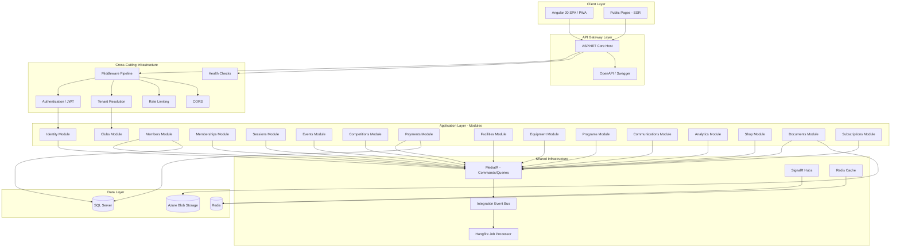
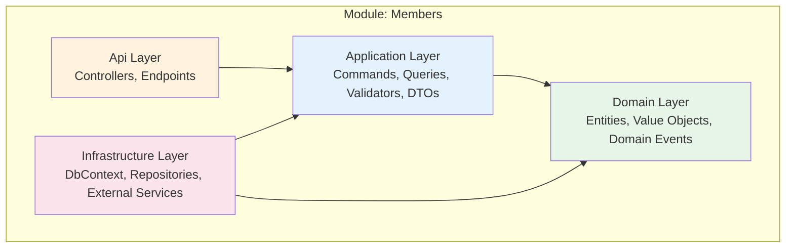
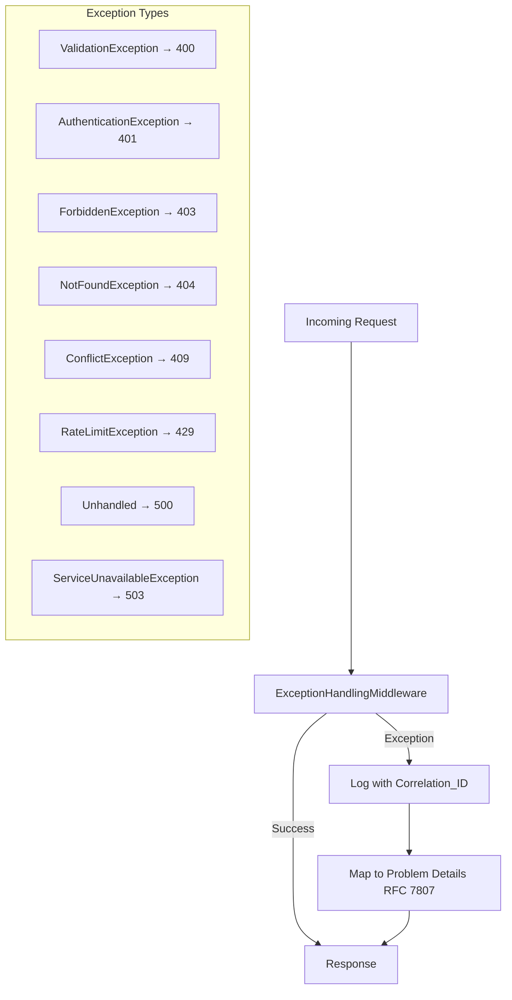
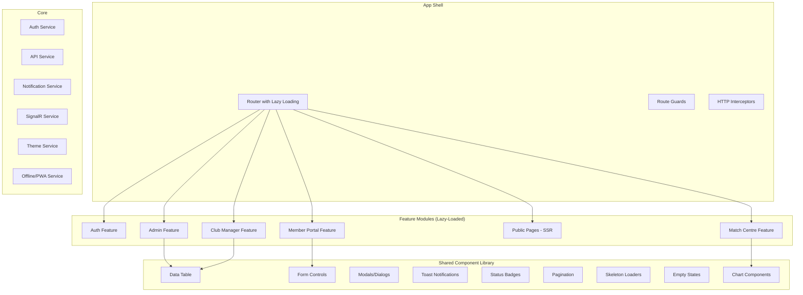
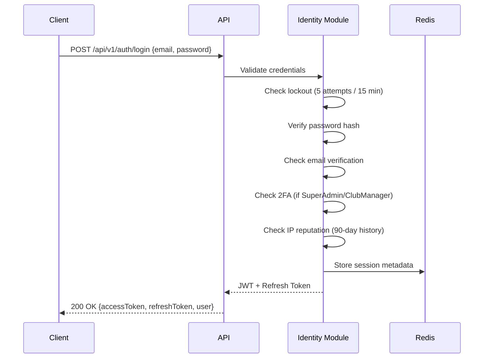
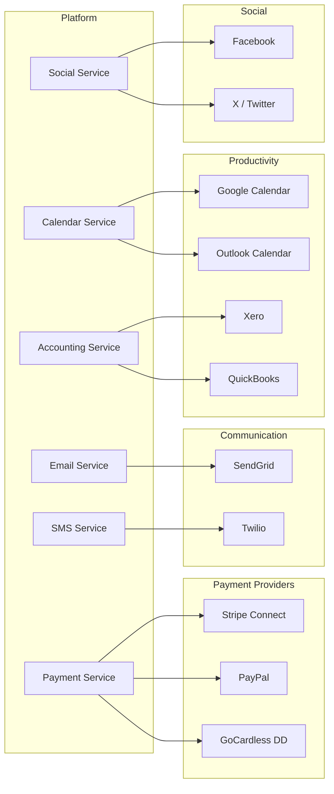
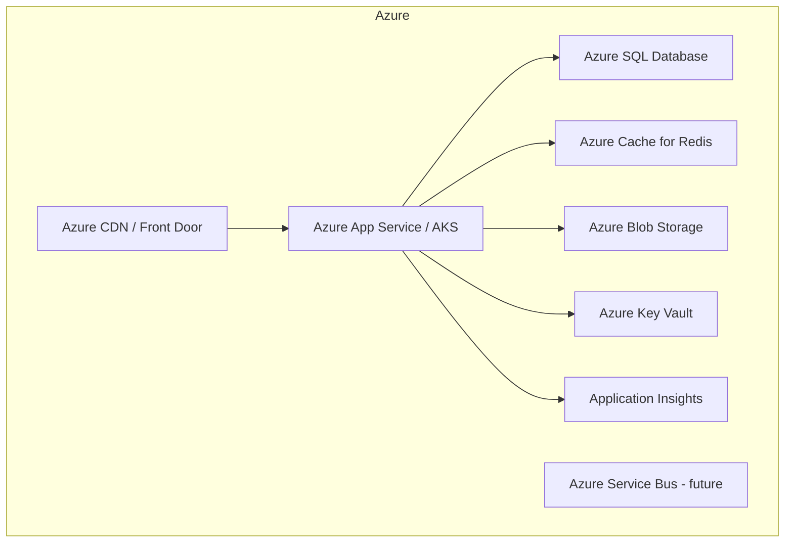

# Design Document: The League Platform

## Overview

The League is a multi-tenant SaaS platform for managing sports club memberships, sessions, events, payments, and competitions. This design describes a full production-grade rebuild using a Modular Monolith architecture with Clean Architecture per module, CQRS via MediatR, and a modern Angular 20 frontend.

The platform serves multiple sport types (Cricket, Football, Hockey, Rugby, Tennis, Swimming, Athletics, Golf) and provides tiered subscription billing, self-service onboarding, real-time notifications, audit/compliance, analytics, and an integration ecosystem.

### Key Design Decisions

| Decision | Rationale |
|----------|-----------|
| Modular Monolith over Microservices | Simpler deployment, shared database transactions, easier debugging — with module boundaries that allow future extraction |
| CQRS with MediatR | Clean separation of reads/writes, cross-cutting concerns via pipeline behaviours, testable handlers |
| Shared database, separate DbContexts | Data consistency without distributed transactions; modules own their schema |
| In-process message bus for integration events | Low latency, no infrastructure overhead; can migrate to RabbitMQ/Azure Service Bus later |
| Angular 20 with Signals | Modern reactivity model, better performance than RxJS-heavy patterns for UI state |
| DaisyUI + Tailwind v4 | Rapid UI development with consistent theming, dark mode support built-in |
| Redis for caching + SignalR backplane | Fast reads, real-time pub/sub, session affinity not required |
| Hangfire for background jobs | Dashboard UI, persistence in SQL Server, retry policies, cron scheduling |

---

## Architecture

### High-Level System Architecture



### Solution Structure

```
TheLeague/
├── src/
│   ├── TheLeague.Host/                          # ASP.NET Core entry point
│   │   ├── Program.cs                           # Startup, module registration
│   │   ├── appsettings.json                     # Configuration
│   │   └── Dockerfile                           # Multi-stage build
│   │
│   ├── TheLeague.Shared/                        # Shared kernel
│   │   ├── TheLeague.Shared.Contracts/          # Module interfaces, integration events
│   │   ├── TheLeague.Shared.Domain/             # Base entities, value objects, enums
│   │   └── TheLeague.Shared.Infrastructure/     # Common infra (caching, messaging, tenancy)
│   │
│   ├── Modules/
│   │   ├── TheLeague.Modules.Identity/
│   │   │   ├── Domain/                          # User, Role, RefreshToken entities
│   │   │   ├── Application/
│   │   │   │   ├── Commands/                    # Login, Register, RefreshToken, etc.
│   │   │   │   └── Queries/                     # GetCurrentUser, GetSessions
│   │   │   ├── Infrastructure/
│   │   │   │   ├── Persistence/                 # IdentityDbContext, migrations
│   │   │   │   └── Services/                    # JwtService, PasswordService
│   │   │   └── Api/                             # AuthController, endpoints
│   │   │
│   │   ├── TheLeague.Modules.Clubs/
│   │   ├── TheLeague.Modules.Members/
│   │   ├── TheLeague.Modules.Memberships/
│   │   ├── TheLeague.Modules.Sessions/
│   │   ├── TheLeague.Modules.Events/
│   │   ├── TheLeague.Modules.Competitions/
│   │   ├── TheLeague.Modules.Payments/
│   │   ├── TheLeague.Modules.Facilities/
│   │   ├── TheLeague.Modules.Equipment/
│   │   ├── TheLeague.Modules.Programs/
│   │   ├── TheLeague.Modules.Communications/
│   │   ├── TheLeague.Modules.Analytics/
│   │   ├── TheLeague.Modules.Shop/
│   │   ├── TheLeague.Modules.Documents/
│   │   └── TheLeague.Modules.Subscriptions/
│   │
│   └── the-league-client/                       # Angular 20 SPA
│       ├── src/
│       │   ├── app/
│       │   │   ├── core/                        # Guards, interceptors, services
│       │   │   ├── shared/                      # Component library, pipes, directives
│       │   │   ├── features/
│       │   │   │   ├── auth/                    # Login, register, password flows
│       │   │   │   ├── admin/                   # SuperAdmin portal
│       │   │   │   ├── club/                    # ClubManager portal
│       │   │   │   ├── portal/                  # Member portal
│       │   │   │   ├── public/                  # Landing, club pages (SSR)
│       │   │   │   └── match-centre/            # Live scoring
│       │   │   └── layouts/                     # Admin, Portal, Public layouts
│       │   ├── assets/
│       │   └── environments/
│       └── angular.json
│
├── tests/
│   ├── TheLeague.Tests.Unit/                    # Per-module unit tests
│   ├── TheLeague.Tests.Integration/             # Cross-module integration tests
│   ├── TheLeague.Tests.Architecture/            # ArchUnit-style dependency tests
│   └── TheLeague.Tests.E2E/                     # Playwright E2E tests
│
├── docker-compose.yml                           # Local dev environment
├── docker-compose.override.yml                  # Dev overrides
└── .github/workflows/                           # CI/CD pipelines
```

### Module Internal Structure (Clean Architecture per Module)

Each module follows the same layered structure:



**Dependency Rule:** Dependencies point inward. Domain has zero external dependencies. Application depends only on Domain. Infrastructure implements Application interfaces.

---

## Components and Interfaces

### Module Boundaries and Responsibilities

| Module | Owns | Publishes Events | Consumes Events |
|--------|------|-----------------|-----------------|
| **Identity** | Users, Roles, Tokens, Sessions | UserRegistered, UserRoleChanged | — |
| **Clubs** | Clubs, ClubSettings, SportConfig | ClubCreated, ClubDeactivated | SubscriptionChanged |
| **Members** | Members, FamilyMembers, CustomFields, Notes | MemberCreated, MemberStatusChanged | UserRegistered |
| **Memberships** | MembershipTypes, Memberships, Discounts, Freezes, Waitlists | MembershipEnrolled, MembershipExpired, MembershipRenewed | MemberCreated, PaymentCompleted, PaymentFailed |
| **Sessions** | Sessions, RecurringSchedules, Bookings, Waitlists, Attendance | BookingConfirmed, BookingCancelled, SessionCancelled | MemberCreated |
| **Events** | Events, EventSeries, Tickets, RSVPs, Registrations | EventPublished, EventCancelled, TicketPurchased | PaymentCompleted |
| **Competitions** | Seasons, Competitions, Teams, Matches, Standings | MatchCompleted, StandingsUpdated | — |
| **Payments** | Payments, Invoices, Refunds, PaymentPlans, MemberBalances | PaymentCompleted, PaymentFailed, InvoiceOverdue, RefundProcessed | MembershipRenewed, TicketPurchased, FacilityBooked |
| **Facilities** | Facilities, Bookings, Schedules, Maintenance, Blockouts | FacilityBooked, BookingCancelled | — |
| **Equipment** | Equipment, Loans, Reservations, Maintenance | LoanOverdue | — |
| **Programs** | Programs, Sessions, Enrolments, Attendance, Certificates | ProgramCompleted, CertificateIssued | — |
| **Communications** | Templates, Campaigns, EmailLogs, SMSLogs | — | All notification-triggering events |
| **Analytics** | Snapshots, HealthScores, ChurnPredictions | — | MemberCreated, PaymentCompleted, BookingConfirmed, etc. |
| **Shop** | Products, Variants, Orders, Categories | OrderCreated | PaymentCompleted, PaymentFailed |
| **Documents** | Documents, Metadata | DocumentUploaded | — |
| **Subscriptions** | Tiers, Subscriptions, Trials, UsageLimits | SubscriptionChanged, TrialExpired, LimitReached | ClubCreated, PaymentCompleted |

### Shared Contracts Project

```csharp
// TheLeague.Shared.Contracts/IModule.cs
public interface IModule
{
    string Name { get; }
    void RegisterModule(IServiceCollection services, IConfiguration configuration);
    void UseModule(IApplicationBuilder app);
}

// TheLeague.Shared.Contracts/Events/IntegrationEvent.cs
public abstract record IntegrationEvent
{
    public Guid Id { get; init; } = Guid.NewGuid();
    public DateTime OccurredAt { get; init; } = DateTime.UtcNow;
    public Guid? TenantId { get; init; }
}

// Example integration events
public record MemberCreatedEvent(Guid MemberId, Guid ClubId, string Email) : IntegrationEvent;
public record PaymentCompletedEvent(Guid PaymentId, Guid MemberId, Guid ClubId, decimal Amount) : IntegrationEvent;
public record MembershipExpiredEvent(Guid MembershipId, Guid MemberId, Guid ClubId) : IntegrationEvent;
```

### CQRS Implementation

```csharp
// Command example
public record CreateMemberCommand(
    Guid ClubId,
    string FirstName,
    string LastName,
    string Email,
    string? Phone,
    DateTime? DateOfBirth
) : IRequest<Result<MemberDto>>;

// Command Handler
public class CreateMemberCommandHandler : IRequestHandler<CreateMemberCommand, Result<MemberDto>>
{
    private readonly IMembersDbContext _db;
    private readonly IIntegrationEventBus _eventBus;

    public async Task<Result<MemberDto>> Handle(CreateMemberCommand request, CancellationToken ct)
    {
        // Domain logic, validation, persistence
        var member = Member.Create(request.ClubId, request.FirstName, ...);
        _db.Members.Add(member);
        await _db.SaveChangesAsync(ct);

        await _eventBus.PublishAsync(new MemberCreatedEvent(member.Id, member.ClubId, member.Email));
        return Result.Success(member.ToDto());
    }
}

// Query example
public record GetMembersQuery(
    Guid ClubId,
    string? SearchTerm,
    MemberStatus? Status,
    int Page = 1,
    int PageSize = 20
) : IRequest<PagedResult<MemberDto>>;
```

### MediatR Pipeline Behaviours

```csharp
// Execution order:
// 1. LoggingBehaviour — logs command/query with correlation ID
// 2. ValidationBehaviour — runs FluentValidation validators
// 3. TenantBehaviour — injects/validates tenant context
// 4. PerformanceBehaviour — logs slow requests (>500ms)
// 5. TransactionBehaviour — wraps commands in a transaction (queries excluded)
// 6. Handler execution
```

### Integration Event Bus (In-Process)

```csharp
public interface IIntegrationEventBus
{
    Task PublishAsync<T>(T @event, CancellationToken ct = default) where T : IntegrationEvent;
    void Subscribe<T>(Func<T, CancellationToken, Task> handler) where T : IntegrationEvent;
}

// Implementation uses Channel<T> for async dispatch
// Handlers registered per module at startup
// Failed handlers retry 3x with exponential backoff, then dead-letter
```

---

## Data Models

### Multi-Tenancy Strategy

- **Approach:** Shared database with `ClubId` discriminator
- **Enforcement:** EF Core global query filters on all tenant-scoped entities
- **Resolution:** JWT claim extraction via `ITenantService` (scoped per request)
- **SuperAdmin bypass:** Conditional filter removal for platform-wide queries

```csharp
// Base entity for all tenant-scoped data
public abstract class TenantEntity : BaseEntity
{
    public Guid ClubId { get; protected set; }
}

// DbContext applies filters
protected override void OnModelCreating(ModelBuilder builder)
{
    builder.Entity<Member>().HasQueryFilter(m => m.ClubId == _tenantService.CurrentTenantId);
    // Applied to all tenant-scoped entities
}
```

### Per-Module DbContext Design

Each module owns its DbContext with only its entities mapped:

| Module | DbContext | Key Entities |
|--------|-----------|--------------|
| Identity | IdentityDbContext | ApplicationUser, Role, RefreshToken, UserSession |
| Clubs | ClubsDbContext | Club, ClubSettings, SportConfiguration |
| Members | MembersDbContext | Member, FamilyMember, CustomFieldDefinition, MemberNote, MemberDocument |
| Memberships | MembershipsDbContext | MembershipType, Membership, MembershipDiscount, MembershipFreeze, MembershipWaitlist, GuestPass |
| Sessions | SessionsDbContext | Session, RecurringSchedule, SessionBooking, RecurringBooking, Waitlist, Attendance |
| Events | EventsDbContext | Event, EventSeries, EventSession, EventTicket, EventRSVP, EventRegistration |
| Competitions | CompetitionsDbContext | Season, Competition, CompetitionTeam, CompetitionParticipant, Match, MatchEvent, MatchLineup, CompetitionStanding |
| Payments | PaymentsDbContext | Payment, Invoice, InvoiceLineItem, PaymentPlan, PaymentInstallment, MemberBalance, BalanceTransaction, Refund, Fee, ChartOfAccount, JournalEntry |
| Facilities | FacilitiesDbContext | Facility, FacilityBooking, FacilityAvailability, FacilityPricing, FacilityMaintenance, FacilityBlockout, VenueOperatingSchedule |
| Equipment | EquipmentDbContext | Equipment, EquipmentLoan, EquipmentReservation, EquipmentMaintenance |
| Programs | ProgramsDbContext | Program, ProgramSession, ProgramEnrollment, ProgramAttendance, MemberCertificate |
| Communications | CommunicationsDbContext | CommunicationTemplate, EmailLog, BulkEmailCampaign, SmsLog |
| Analytics | AnalyticsDbContext | ClubAnalyticsSnapshot, MemberEngagement, ChurnPrediction |
| Shop | ShopDbContext | Product, ProductVariant, ProductCategory, Order, OrderItem |
| Documents | DocumentsDbContext | Document, DocumentMetadata |
| Subscriptions | SubscriptionsDbContext | SubscriptionTier, ClubSubscription, Trial, UsageRecord, AddOn |

### Core Entity Schemas

```csharp
// Club (Tenant Root)
public class Club : BaseEntity
{
    public string Name { get; private set; }              // max 200
    public string Slug { get; private set; }              // max 100, unique
    public string? Description { get; private set; }
    public string? LogoUrl { get; private set; }
    public string PrimaryColor { get; private set; }      // default #1E40AF
    public string SecondaryColor { get; private set; }    // default #3B82F6
    public string? AccentColor { get; private set; }
    public string? ContactEmail { get; private set; }
    public string? ContactPhone { get; private set; }
    public string? Address { get; private set; }
    public string? Website { get; private set; }
    public ClubType ClubType { get; private set; }
    public bool IsActive { get; private set; }
    public DateTime CreatedAt { get; private set; }
}

// Member (Tenant-Scoped)
public class Member : TenantEntity
{
    public Guid? UserId { get; private set; }
    public string MemberNumber { get; private set; }      // unique per club
    public string FirstName { get; private set; }
    public string LastName { get; private set; }
    public string Email { get; private set; }
    public string? Phone { get; private set; }
    public DateTime? DateOfBirth { get; private set; }
    public Gender? Gender { get; private set; }
    public Address Address { get; private set; }          // Value Object
    public EmergencyContact PrimaryEmergencyContact { get; private set; }  // VO
    public MedicalInfo MedicalInfo { get; private set; }  // VO
    public MemberStatus Status { get; private set; }
    public DateTime JoinedDate { get; private set; }
    public string? CustomFieldValues { get; private set; } // JSON
    // ... navigation properties
}

// Membership
public class Membership : TenantEntity
{
    public Guid MemberId { get; private set; }
    public Guid MembershipTypeId { get; private set; }
    public DateTime StartDate { get; private set; }
    public DateTime EndDate { get; private set; }
    public MembershipStatus Status { get; private set; }
    public bool AutoRenew { get; private set; }
    public decimal PricePaid { get; private set; }
}

// Payment
public class Payment : TenantEntity
{
    public Guid MemberId { get; private set; }
    public decimal Amount { get; private set; }           // DECIMAL(18,2)
    public PaymentMethod Method { get; private set; }
    public PaymentStatus Status { get; private set; }
    public PaymentType Type { get; private set; }
    public string? ExternalTransactionId { get; private set; }
    public string? FailureReason { get; private set; }
    public DateTime PaymentDate { get; private set; }
    public decimal PlatformFee { get; private set; }      // DECIMAL(18,2)
}

// Invoice
public class Invoice : TenantEntity
{
    public Guid MemberId { get; private set; }
    public string InvoiceNumber { get; private set; }     // unique per club
    public InvoiceStatus Status { get; private set; }
    public DateTime IssueDate { get; private set; }
    public DateTime DueDate { get; private set; }
    public decimal TotalAmount { get; private set; }
    public decimal PaidAmount { get; private set; }
    public List<InvoiceLineItem> LineItems { get; private set; }
}
```

### Key Database Indexes

| Table | Columns | Type | Purpose |
|-------|---------|------|---------|
| Club | Slug | UNIQUE | URL resolution |
| Member | (ClubId, Email) | UNIQUE | Prevent duplicate members |
| Member | (ClubId, MemberNumber) | UNIQUE | Member lookup |
| Member | (ClubId, Status) | COMPOSITE | Filtered queries |
| Membership | (ClubId, MemberId, Status) | COMPOSITE | Active membership lookup |
| Session | (ClubId, StartTime) | COMPOSITE | Schedule queries |
| SessionBooking | (SessionId, MemberId) | UNIQUE | Prevent double-booking |
| Payment | (ClubId, PaymentDate) | COMPOSITE | Financial reports |
| Invoice | (ClubId, InvoiceNumber) | UNIQUE | Invoice lookup |
| Event | (ClubId, StartDateTime) | COMPOSITE | Event listing |
| Competition | (ClubId, SeasonId) | COMPOSITE | Season filtering |
| AuditLog | (EntityType, EntityId) | COMPOSITE | Audit trail queries |
| AuditLog | (Timestamp) | INDEX | Time-based queries |

### Cascade Delete Strategy

| Relationship | Behaviour | Rationale |
|-------------|-----------|-----------|
| Club → Members | RESTRICT | Prevent accidental data loss |
| Club → ClubSettings | CASCADE | Settings are club-owned |
| Member → FamilyMembers | CASCADE | Dependents follow primary |
| Member → Bookings | RESTRICT | Preserve booking history |
| Member → Payments | RESTRICT | Financial records must persist |
| Session → Bookings | CASCADE | Session removal clears bookings |
| Event → Tickets | CASCADE | Event removal clears tickets |
| MembershipType → Memberships | RESTRICT | Cannot delete type with active memberships |
| Product → Variants | CASCADE | Variants are product-owned |
| Order → OrderItems | CASCADE | Items follow order |

---


## Correctness Properties

*A property is a characteristic or behavior that should hold true across all valid executions of a system — essentially, a formal statement about what the system should do. Properties serve as the bridge between human-readable specifications and machine-verifiable correctness guarantees.*

### Property 1: Tenant Data Isolation

*For any* set of tenant-scoped entities distributed across multiple clubs, and *for any* authenticated request with a specific ClubId, all query results SHALL contain only entities matching that ClubId, and any attempt to access or modify an entity belonging to a different ClubId SHALL be rejected.

**Validates: Requirements 1.3, 1.4**

### Property 2: ClubId Extraction and Validation

*For any* JWT payload, if the ClubId claim is present and is a well-formed GUID then the tenant context SHALL be set to that GUID; if the ClubId claim is missing, empty, or not a valid GUID then the request SHALL be rejected with a 403 response.

**Validates: Requirements 1.2, 1.6**

### Property 3: JWT Claim Completeness

*For any* authenticated user with a valid role and club assignment, the issued JWT SHALL contain all required claims (sub, email, name, role, clubId, memberId, jti) with non-null values for sub, email, role, and jti.

**Validates: Requirements 2.5**

### Property 4: Credential Error Message Opacity

*For any* authentication attempt with invalid credentials (wrong email, wrong password, or both), the error response SHALL be identical regardless of which credential was incorrect, revealing no information about which field failed.

**Validates: Requirements 2.2**

### Property 5: Refresh Token Rotation

*For any* valid, non-revoked refresh token presented for renewal, the system SHALL issue a new access token and a new refresh token, and the consumed refresh token SHALL be invalidated such that subsequent use returns 401.

**Validates: Requirements 2.3**

### Property 6: Role-Permission Matrix Enforcement

*For any* authenticated user with a given role and *for any* resource endpoint, the access decision (grant or deny) SHALL match the defined permission matrix: SuperAdmin has full platform access, ClubManager has full CRUD on their club, Member has self-service access only, Coach has session/attendance access, Staff has read-only access.

**Validates: Requirements 3.1, 3.2, 3.3, 3.4, 3.5, 3.6, 3.7**

### Property 7: Subscription Proration Calculation

*For any* tier upgrade from tier A (price PA) to tier B (price PB) at day D of a billing period of length L days, the prorated charge SHALL equal (PB - PA) × (L - D) / L, rounded to 2 decimal places.

**Validates: Requirements 4.5**

### Property 8: Usage Limit Enforcement

*For any* club on a given subscription tier and *for any* action that would exceed a tier limit (member count, storage, SMS credits), the system SHALL block the action and return an error indicating the limit reached.

**Validates: Requirements 4.7, 4.8**

### Property 9: CSV Import Correctness

*For any* CSV file containing a mix of valid and invalid rows, the import service SHALL create Member records for all valid rows, reject all invalid rows, and the count of imported + rejected rows SHALL equal the total row count, with each rejected row accompanied by the correct field name and rejection reason.

**Validates: Requirements 5.6, 5.7**

### Property 10: Member Number Uniqueness and Format

*For any* sequence of member creations within a single club, each generated member number SHALL be unique within that club and SHALL match the format "MBR-{N}" where N is a zero-padded sequential number (minimum 3 digits).

**Validates: Requirements 6.2**

### Property 11: Member Status State Machine

*For any* member in a given status, a transition attempt SHALL succeed if and only if the transition is in the permitted set {Pending→Active, Active→Expired, Active→Suspended, Active→Cancelled, Suspended→Active, Expired→Active}. All other transitions SHALL be rejected with an error indicating the current and invalid target status.

**Validates: Requirements 6.5, 6.6**

### Property 12: Custom Field Type Validation

*For any* custom field definition with a declared type (Text, Number, Date, Boolean, Select, MultiSelect, TextArea) and *for any* submitted value, the validation SHALL accept values conforming to the type definition and reject values that do not conform.

**Validates: Requirements 6.8, 6.9**

### Property 13: Membership Age Limit Enforcement

*For any* member with a given age and *for any* membership type with configured minimum and maximum age limits, enrolment SHALL be accepted if and only if the member's age is within the inclusive range [minimum, maximum].

**Validates: Requirements 7.3, 7.4**

### Property 14: Discount Calculation Correctness

*For any* base price and *for any* discount configuration (percentage 0.01–100% or fixed amount 0.01–999,999.99), the calculated discounted price SHALL equal: base - (base × percentage / 100) for percentage discounts, or base - fixedAmount for fixed discounts, with the result never going below zero and rounded to 2 decimal places.

**Validates: Requirements 7.8**

### Property 15: Session Booking Capacity Invariant

*For any* session with capacity N, the count of confirmed bookings SHALL never exceed N. When confirmed bookings equal N, subsequent booking attempts SHALL be placed on the waitlist.

**Validates: Requirements 8.3, 8.4**

### Property 16: Waitlist Ordering Preservation

*For any* session at full capacity, members added to the waitlist SHALL be ordered by request time (first-come-first-served), and when a slot opens, the member with the earliest request time SHALL be offered the slot first.

**Validates: Requirements 8.4, 8.5**

### Property 17: Cancellation Deadline Enforcement

*For any* booking with a session start time T and a cancellation deadline of D hours before T, a cancellation request at time R SHALL be accepted if R ≤ (T - D hours) and rejected if R > (T - D hours).

**Validates: Requirements 8.6**

### Property 18: Event Lifecycle State Machine

*For any* event in a given state, a transition SHALL succeed if and only if it follows the permitted paths: Draft→Published→RegistrationOpen→RegistrationClosed→InProgress→Completed, and any active state→Cancelled or Postponed. All other transitions SHALL be rejected.

**Validates: Requirements 9.7**

### Property 19: Round-Robin Fixture Completeness

*For any* set of N teams (N ≥ 2) in a round-robin competition, the generated fixtures SHALL contain exactly N×(N-1)/2 matches, where each team plays every other team exactly once.

**Validates: Requirements 10.4**

### Property 20: League Standings Calculation

*For any* set of completed match results in a league competition, the standings SHALL correctly reflect: 3 points per win, 1 per draw, 0 per loss; goal difference = goals scored - goals conceded; and the total points SHALL equal 3×wins + 1×draws for each team.

**Validates: Requirements 10.6**

### Property 21: Match Event Constraints

*For any* match, the system SHALL enforce: maximum 5 substitutions per team, exactly 11 starting players per team in the lineup, and yellow/red card events reference valid players from the match lineup.

**Validates: Requirements 10.8**

### Property 22: Match Status State Machine

*For any* match in a given status, transitions SHALL be valid only per the defined set: Scheduled→{Confirmed, Cancelled}, Confirmed→{InProgress, Postponed, Cancelled}, InProgress→{Completed, Abandoned}, Postponed→{Confirmed, Cancelled}. All other transitions SHALL be rejected.

**Validates: Requirements 10.9**

### Property 23: Invoice Lifecycle State Machine

*For any* invoice in a given status, transitions SHALL follow: Draft→Sent→Viewed→PartiallyPaid→Paid, Sent→Overdue, and any non-terminal state→Voided. All other transitions SHALL be rejected.

**Validates: Requirements 11.4**

### Property 24: Member Balance Ledger Invariant

*For any* member and *for any* sequence of credit and debit transactions applied to their balance, the current balance SHALL equal the sum of all credits minus the sum of all debits, maintained at DECIMAL(18,2) precision.

**Validates: Requirements 11.7**

### Property 25: Double-Entry Bookkeeping Balance

*For any* journal entry, the sum of all debit line amounts SHALL equal the sum of all credit line amounts. A journal entry that does not satisfy this constraint SHALL be rejected before persistence.

**Validates: Requirements 11.10**

### Property 26: Facility Booking Conflict Detection

*For any* facility and *for any* time period, no two confirmed bookings SHALL overlap. A booking request that overlaps with an existing confirmed booking, maintenance window, or blockout period SHALL be rejected.

**Validates: Requirements 12.3, 12.6**

### Property 27: Equipment Loan Availability

*For any* equipment item and *for any* requested loan period, the loan SHALL be approved if and only if: the equipment condition is loanable (not NeedsRepair, Damaged, or Decommissioned) AND no overlapping active loan or approved reservation exists for that period.

**Validates: Requirements 13.2, 13.3**

### Property 28: Program Enrolment Capacity

*For any* program with a configured capacity, the count of confirmed enrolments SHALL never exceed that capacity. When capacity is reached, new enrolment attempts SHALL be waitlisted (up to 50), and when the waitlist is full, enrolment SHALL be rejected.

**Validates: Requirements 14.3, 14.4, 14.5**

### Property 29: Certificate Issuance Threshold

*For any* member enrolled in a program, a certificate SHALL be issued if and only if the member's attendance rate (attended sessions / total scheduled sessions) is at least 80% AND the program end date has passed.

**Validates: Requirements 14.7**

### Property 30: Club Health Score Calculation

*For any* set of club metrics (member growth rate, payment collection rate, session attendance rate, event participation rate), the health score SHALL equal the weighted average with each metric weighted at 25%, producing a value between 0 and 100.

**Validates: Requirements 19.1**

### Property 31: Churn Prediction Logic

*For any* member with activity data over a 90-day window, the member SHALL be flagged as at-risk if and only if at least one of: attendance drops ≥50% vs prior 90 days, ≥2 consecutive missed payments, or login frequency drops ≥50% vs prior 90 days. Members with no bookings or registrations in the window SHALL be excluded from prediction.

**Validates: Requirements 19.2, 19.8**

### Property 32: Pagination Calculation

*For any* collection of size S with page P and pageSize PS, the response SHALL contain: totalCount = S, totalPages = ⌈S/PS⌉, page = min(P, totalPages) when P > totalPages defaults to 1, and items count = min(PS, S - (P-1)×PS) for valid pages.

**Validates: Requirements 26.3**

### Property 33: Currency Formatting

*For any* decimal value, the GBP formatting function SHALL produce a string matching the pattern "£{N},{NNN}.{NN}" with comma thousand separators and period decimal separator, always showing exactly 2 decimal places (e.g., 1234.5 → "£1,234.50").

**Validates: Requirements 34.1**

### Property 34: Stock Decrement Invariant

*For any* product variant with stock quantity Q and *for any* successful purchase of quantity 1, the resulting stock SHALL be Q - 1. If Q = 0, the purchase SHALL be rejected and stock SHALL remain 0.

**Validates: Requirements 38.2, 38.4**

### Property 35: Order Status State Machine

*For any* order in a given status, transitions SHALL follow: Pending→Confirmed, Confirmed→Dispatched, Dispatched→Delivered, and {Pending, Confirmed, Dispatched}→Refunded. All other transitions SHALL be rejected.

**Validates: Requirements 38.8**

---

## Error Handling

### Global Exception Handling Strategy



### Error Response Format (RFC 7807)

```json
{
  "type": "https://theleague.com/errors/validation-error",
  "title": "Validation Error",
  "status": 400,
  "detail": "One or more validation errors occurred.",
  "instance": "/api/v1/members",
  "traceId": "00-abc123-def456-01",
  "errors": [
    { "field": "email", "message": "Email is already registered in this club." }
  ]
}
```

### Circuit Breaker Pattern

External service calls (Stripe, SendGrid, Twilio, GoCardless) use Polly circuit breakers:

| Parameter | Value |
|-----------|-------|
| Failure threshold | 5 failures in 30 seconds |
| Break duration | 30 seconds (open state) |
| Half-open test | 1 request allowed through |
| Fallback | Queue operation for retry, return graceful degradation response |

```csharp
// Polly configuration per external service
services.AddHttpClient<IStripeClient>()
    .AddPolicyHandler(Policy.Handle<HttpRequestException>()
        .CircuitBreakerAsync(
            handledEventsAllowedBeforeBreaking: 5,
            durationOfBreak: TimeSpan.FromSeconds(30),
            onBreak: (ex, duration) => logger.LogWarning("Circuit open for Stripe"),
            onReset: () => logger.LogInformation("Circuit closed for Stripe")));
```

### Resilience Patterns

| Scenario | Strategy |
|----------|----------|
| Redis unavailable | Fall back to in-memory cache (IMemoryCache) |
| DB connection pool exhausted | Queue with 30s timeout → 503 |
| External API timeout | 30s timeout, retry 3x with exponential backoff |
| Background job failure | Retry 3x (30s, 60s, 120s), then alert ops team |
| SignalR disconnect | Auto-reconnect 5x with exponential backoff |
| File upload virus detected | Reject, discard content, return error |

### Request Timeout Policies

| Operation Type | Timeout |
|---------------|---------|
| Standard API calls | 30 seconds |
| Report generation | 120 seconds |
| Data imports (CSV/Excel) | 300 seconds |
| File uploads | 60 seconds |
| Health checks | 5 seconds |

### Structured Logging

All log entries include:
- `CorrelationId` — traces request across all layers
- `TenantId` — identifies the club context
- `UserId` — identifies the actor
- `Timestamp` — UTC
- `Level` — Information, Warning, Error, Critical
- `Module` — which module generated the log

```csharp
// Serilog enrichment
Log.Logger = new LoggerConfiguration()
    .Enrich.WithCorrelationId()
    .Enrich.WithProperty("Application", "TheLeague")
    .WriteTo.Console(new JsonFormatter())
    .WriteTo.Seq("http://localhost:5341")  // Dev
    .CreateLogger();
```

---

## Testing Strategy

### Dual Testing Approach

The platform uses both unit tests and property-based tests for comprehensive coverage:

- **Unit tests** (xUnit): Verify specific examples, edge cases, integration points, and error conditions
- **Property-based tests** (FsCheck.xUnit): Verify universal properties across all valid inputs with minimum 100 iterations per property
- **Integration tests** (xUnit + TestContainers): Verify cross-module interactions, database operations, and external service integrations
- **Architecture tests** (NetArchTest): Verify module boundaries, dependency rules, and Clean Architecture compliance
- **E2E tests** (Playwright): Verify critical user journeys through the full stack

### Property-Based Testing Configuration

- **Library:** FsCheck.xUnit (C# property-based testing library)
- **Minimum iterations:** 100 per property test
- **Tag format:** `Feature: the-league-platform, Property {number}: {property_text}`
- **Each correctness property maps to exactly one property-based test**

```csharp
// Example property test
[Property(MaxTest = 100)]
public Property MemberStatusTransitions_OnlyPermittedTransitionsSucceed(
    MemberStatus currentStatus, MemberStatus targetStatus)
{
    // Feature: the-league-platform, Property 11: Member Status State Machine
    var permitted = MemberStatusMachine.IsValidTransition(currentStatus, targetStatus);
    var result = _service.TransitionStatus(member, targetStatus);

    return (permitted == result.IsSuccess).ToProperty();
}
```

### Test Project Structure

```
tests/
├── TheLeague.Tests.Unit/
│   ├── Modules/
│   │   ├── Members/
│   │   │   ├── Commands/CreateMemberCommandTests.cs
│   │   │   ├── Queries/GetMembersQueryTests.cs
│   │   │   └── Domain/MemberTests.cs
│   │   ├── Memberships/
│   │   ├── Sessions/
│   │   ├── Payments/
│   │   └── ...
│   └── Shared/
│       ├── PaginationTests.cs
│       └── TenantFilterTests.cs
│
├── TheLeague.Tests.Properties/
│   ├── TenantIsolationProperties.cs        # Properties 1-2
│   ├── AuthenticationProperties.cs          # Properties 3-5
│   ├── AuthorizationProperties.cs           # Property 6
│   ├── SubscriptionProperties.cs            # Properties 7-8
│   ├── MemberProperties.cs                  # Properties 9-12
│   ├── MembershipProperties.cs              # Properties 13-14
│   ├── SessionBookingProperties.cs          # Properties 15-17
│   ├── EventProperties.cs                   # Property 18
│   ├── CompetitionProperties.cs             # Properties 19-22
│   ├── PaymentProperties.cs                 # Properties 23-25
│   ├── FacilityProperties.cs                # Property 26
│   ├── EquipmentProperties.cs               # Property 27
│   ├── ProgramProperties.cs                 # Properties 28-29
│   ├── AnalyticsProperties.cs               # Properties 30-31
│   ├── ApiProperties.cs                     # Properties 32-33
│   └── ShopProperties.cs                    # Properties 34-35
│
├── TheLeague.Tests.Integration/
│   ├── DatabaseTests/
│   ├── ExternalServiceTests/
│   └── CrossModuleTests/
│
├── TheLeague.Tests.Architecture/
│   ├── ModuleBoundaryTests.cs
│   ├── DependencyRuleTests.cs
│   └── NamingConventionTests.cs
│
└── TheLeague.Tests.E2E/
    ├── Auth/LoginFlow.spec.ts
    ├── Members/MemberCrud.spec.ts
    ├── Bookings/SessionBooking.spec.ts
    └── Payments/PaymentFlow.spec.ts
```

### Testing Priorities

| Priority | Area | Test Type | Coverage Target |
|----------|------|-----------|-----------------|
| Critical | Tenant isolation | Property + Integration | 100% of tenant-scoped operations |
| Critical | Authentication/Authorization | Property + Unit | All role/permission combinations |
| Critical | Payment processing | Property + Integration | All payment flows |
| High | State machines (member, event, match, invoice, order) | Property | All valid/invalid transitions |
| High | Booking capacity & waitlists | Property | Capacity invariants |
| High | Financial calculations (proration, discounts, balance) | Property | Mathematical correctness |
| Medium | CRUD operations | Unit + Integration | Happy path + validation |
| Medium | Fixture generation | Property | Combinatorial correctness |
| Medium | Analytics calculations | Property | Formula correctness |
| Lower | UI components | Unit (Jest/Karma) | Component rendering |
| Lower | E2E flows | Playwright | Critical user journeys |

### Frontend Testing

- **Unit tests:** Jest with Angular Testing Library for component logic
- **Component tests:** Storybook interaction tests for the component library
- **E2E tests:** Playwright for critical user journeys (login, booking, payment)
- **Visual regression:** Chromatic/Percy for UI consistency across themes

### CI Pipeline Test Stages

```yaml
# .github/workflows/ci.yml
stages:
  - restore-and-build
  - unit-tests          # Fast feedback (~30s)
  - property-tests      # Correctness verification (~2min)
  - architecture-tests  # Boundary enforcement (~10s)
  - integration-tests   # Database + external services (~5min)
  - e2e-tests          # Full stack verification (~10min)
  - build-docker-images
```

---

## API Design

### URL Structure and Versioning

```
/api/v1/{module}/{resource}
/api/v1/{module}/{resource}/{id}
/api/v1/{module}/{resource}/{id}/{sub-resource}
```

Examples:
- `GET /api/v1/members` — List members (paginated)
- `POST /api/v1/members` — Create member
- `GET /api/v1/members/{id}` — Get member by ID
- `PUT /api/v1/members/{id}` — Update member
- `DELETE /api/v1/members/{id}` — Delete member
- `GET /api/v1/members/{id}/family` — Get family members
- `POST /api/v1/sessions/{id}/bookings` — Book a session
- `POST /api/v1/competitions/{id}/fixtures/generate` — Generate fixtures

### Standard Response Envelope

```csharp
// Single item response
public class ApiResponse<T>
{
    public bool Success { get; init; }
    public string? Message { get; init; }
    public T? Data { get; init; }
}

// Collection response (paginated)
public class PagedResponse<T>
{
    public List<T> Items { get; init; }
    public int TotalCount { get; init; }
    public int Page { get; init; }
    public int PageSize { get; init; }
    public int TotalPages { get; init; }
}
```

### Authentication Headers

```
Authorization: Bearer <access_token>
X-Correlation-Id: <guid>          # Auto-generated if not provided
X-Tenant-Id: <club_id>            # Fallback if not in JWT (admin scenarios)
```

### Rate Limiting

| Context | Limit |
|---------|-------|
| Authenticated users | 100 requests/minute |
| Unauthenticated endpoints | 20 requests/minute |
| Public API (API key) | 1000 requests/hour per key |
| Webhook delivery | 10 requests/second per endpoint |

---

## Frontend Architecture

### Angular 20 Application Structure



### State Management with Signals

```typescript
// Service-based state with Angular Signals
@Injectable({ providedIn: 'root' })
export class MemberStore {
  // State
  private readonly _members = signal<Member[]>([]);
  private readonly _loading = signal(false);
  private readonly _error = signal<string | null>(null);
  private readonly _filters = signal<MemberFilters>({ page: 1, pageSize: 20 });

  // Computed
  readonly members = this._members.asReadonly();
  readonly loading = this._loading.asReadonly();
  readonly totalCount = computed(() => this._members().length);

  // Effects
  constructor() {
    effect(() => {
      const filters = this._filters();
      this.loadMembers(filters);
    });
  }
}
```

### Component Library (DaisyUI + Tailwind v4)

All shared components are standalone, documented in a showcase page, and follow this pattern:

```typescript
@Component({
  selector: 'app-data-table',
  standalone: true,
  imports: [CommonModule],
  template: `...`,
  changeDetection: ChangeDetectionStrategy.OnPush
})
export class DataTableComponent<T> {
  // Inputs via signals
  data = input.required<T[]>();
  columns = input.required<ColumnDef<T>[]>();
  loading = input(false);
  sortable = input(true);
  filterable = input(true);
  pageSize = input(20);

  // Outputs
  rowClick = output<T>();
  sortChange = output<SortEvent>();
  pageChange = output<number>();
}
```

### Theme System

```typescript
// DaisyUI theme configuration with per-club branding
@Injectable({ providedIn: 'root' })
export class ThemeService {
  private readonly _theme = signal<'system' | 'light' | 'dark'>('system');
  private readonly _clubColors = signal<ClubColors | null>(null);

  constructor() {
    // Load from localStorage
    const saved = localStorage.getItem('theme-preference');
    if (saved) this._theme.set(saved as any);

    // Watch OS preference
    window.matchMedia('(prefers-color-scheme: dark)')
      .addEventListener('change', (e) => {
        if (this._theme() === 'system') this.applyTheme(e.matches ? 'dark' : 'light');
      });
  }

  setTheme(theme: 'system' | 'light' | 'dark') {
    this._theme.set(theme);
    localStorage.setItem('theme-preference', theme);
    this.applyTheme(theme);
  }
}
```

### PWA and Offline Strategy

- Service worker caches app shell + last 50 viewed items
- Offline queue stores up to 100 actions in IndexedDB
- Sync on reconnect with conflict resolution UI
- Background sync API for automatic retry

### SSR for Public Pages

- Platform landing page, club profile pages rendered server-side
- Target: LCP ≤ 2.5s on simulated 4G
- Angular SSR with hydration for interactive elements

---

## Infrastructure

### Caching Strategy (Redis)

| Data | TTL | Invalidation |
|------|-----|-------------|
| Club settings | 5 minutes | On update via integration event |
| Membership types | 5 minutes | On create/update/delete |
| Session availability | 2 minutes | On booking/cancellation |
| User permissions | 5 minutes | On role change |
| Dashboard KPIs | 10 minutes | On scheduled refresh |
| Search results | 1 minute | On data change |

**Fallback:** If Redis is unavailable, IMemoryCache serves as fallback with same TTL. Cache-aside pattern used throughout.

### Background Jobs (Hangfire)

| Job | Schedule | Retry Policy |
|-----|----------|-------------|
| Membership auto-renewal | Daily at 02:00 UTC | 3x exponential backoff |
| Payment reminders | Daily at 09:00 UTC | 3x exponential backoff |
| Dunning retries | Days 1, 3, 7 after failure | Per-attempt |
| Analytics snapshot | Weekly (Sunday 03:00 UTC) | 3x |
| Overdue invoice check | Daily at 08:00 UTC | 3x |
| Equipment loan overdue check | Daily at 07:00 UTC | 3x |
| Trial expiry check | Daily at 00:00 UTC | 3x |
| Data retention cleanup | Monthly (1st at 04:00 UTC) | 3x |
| Integration sync (Xero/QB) | Every 60 minutes | 5x per record |
| Calendar sync | Every 5 minutes | 3x |
| Email campaign sending | On-demand (queued) | 3x per recipient |
| Report generation | On-demand (queued) | 1x (timeout at 120s) |

### File Storage (Azure Blob Storage)

```
Container structure:
├── {club-id}/
│   ├── members/
│   │   ├── photos/{member-id}/{filename}
│   │   └── documents/{member-id}/{filename}
│   ├── events/
│   │   └── media/{event-id}/{filename}
│   ├── shop/
│   │   └── products/{product-id}/{filename}
│   └── exports/
│       └── {report-id}/{filename}
```

- Max file size: 10 MB (documents), 50 MB (exports)
- Malware scanning via Azure Defender or ClamAV
- Secure download URLs: SAS tokens with 1-hour expiry
- Image processing: profile photos resized to 300×300, thumbnails to 150×150

### Real-Time Communication (SignalR)

```csharp
// Hub structure
[Authorize]
public class NotificationHub : Hub
{
    public override async Task OnConnectedAsync()
    {
        var clubId = Context.User.FindFirst("clubId")?.Value;
        await Groups.AddToGroupAsync(Context.ConnectionId, $"club-{clubId}");
        await Groups.AddToGroupAsync(Context.ConnectionId, $"user-{Context.UserIdentifier}");
    }
}

[Authorize]
public class MatchCentreHub : Hub
{
    public async Task JoinMatch(Guid matchId)
    {
        await Groups.AddToGroupAsync(Context.ConnectionId, $"match-{matchId}");
    }
}
```

- Redis backplane for multi-instance scaling
- Notification delivery within 2 seconds
- Match updates within 3 seconds
- Max 500 concurrent connections per match

### Health Checks

```csharp
services.AddHealthChecks()
    .AddSqlServer(connectionString, name: "database")
    .AddRedis(redisConnection, name: "redis")
    .AddAzureBlobStorage(blobConnection, name: "blob-storage")
    .AddHangfire(options => options.MinimumAvailableServers = 1, name: "hangfire")
    .AddUrlGroup(new Uri("https://api.stripe.com"), name: "stripe")
    .AddUrlGroup(new Uri("https://api.sendgrid.com"), name: "sendgrid");
```

Response: `Healthy`, `Degraded`, or `Unhealthy` per component within 5 seconds.

---

## Security Architecture

### Authentication Flow



### Security Headers

```
Content-Security-Policy: default-src 'self'; script-src 'self'; style-src 'self' 'unsafe-inline'
X-Content-Type-Options: nosniff
X-Frame-Options: DENY
Strict-Transport-Security: max-age=31536000; includeSubDomains
X-XSS-Protection: 0
Referrer-Policy: strict-origin-when-cross-origin
Permissions-Policy: camera=(), microphone=(), geolocation=()
```

### Data Protection

| Data Category | Protection |
|--------------|-----------|
| Passwords | BCrypt hash (work factor 12) |
| Refresh tokens | SHA-256 hash stored, raw value returned once |
| API keys | SHA-256 hash stored, prefix shown for identification |
| PII (medical, address) | Encrypted at rest (SQL Server TDE) |
| File uploads | Encrypted at rest (Azure SSE) |
| Audit logs | Immutable (no UPDATE/DELETE permissions) |

### GDPR Compliance

- **Data export:** Generate JSON/CSV of all member PII within 72 hours
- **Data erasure:** Anonymise PII within 30 days, preserve financial aggregates for 7 years
- **Consent tracking:** Per-channel opt-in/opt-out (email, SMS, marketing)
- **Data retention:** Auto-delete after configurable inactivity period (default 7 years)

---

## Integration Patterns

### External Service Integration Architecture



### Provider Pattern

```csharp
// Abstract provider interface
public interface IPaymentProvider
{
    Task<PaymentResult> ProcessPaymentAsync(PaymentRequest request, CancellationToken ct);
    Task<RefundResult> ProcessRefundAsync(RefundRequest request, CancellationToken ct);
}

// Factory resolves provider per club configuration
public class PaymentProviderFactory
{
    public IPaymentProvider GetProvider(PaymentMethod method, ClubSettings settings)
        => method switch
        {
            PaymentMethod.Stripe => new StripePaymentProvider(settings.StripeConfig),
            PaymentMethod.PayPal => new PayPalPaymentProvider(settings.PayPalConfig),
            PaymentMethod.GoCardless => new GoCardlessPaymentProvider(settings.GoCardlessConfig),
            _ => throw new NotSupportedException($"Provider {method} not configured")
        };
}
```

### Webhook Handling

- Idempotent processing (store webhook event IDs, skip duplicates)
- Signature verification per provider
- Async processing via Hangfire (acknowledge immediately, process in background)
- Dead-letter queue for failed webhook processing

---

## Deployment Architecture

### Container Architecture

```yaml
# docker-compose.yml (local development)
services:
  api:
    build: ./src/TheLeague.Host
    ports: ["7000:8080"]
    depends_on: [sqlserver, redis, azurite]
    environment:
      - ASPNETCORE_ENVIRONMENT=Development
      - ConnectionStrings__DefaultConnection=...
      - Redis__ConnectionString=redis:6379

  client:
    build: ./src/the-league-client
    ports: ["4200:80"]
    depends_on: [api]

  sqlserver:
    image: mcr.microsoft.com/mssql/server:2022-latest
    ports: ["1433:1433"]

  redis:
    image: redis:7-alpine
    ports: ["6379:6379"]

  azurite:
    image: mcr.microsoft.com/azure-storage/azurite
    ports: ["10000:10000", "10001:10001"]

  hangfire-dashboard:
    # Exposed via API at /hangfire (admin only)
```

### Production Deployment (Azure)



### Environment Configuration

| Setting | Development | Staging | Production |
|---------|-------------|---------|------------|
| Database | LocalDB / Docker SQL | Azure SQL (Basic) | Azure SQL (Standard S3) |
| Redis | Docker Redis | Azure Redis (Basic) | Azure Redis (Standard) |
| Storage | Azurite | Azure Blob (LRS) | Azure Blob (GRS) |
| Secrets | appsettings.Development.json | Azure Key Vault | Azure Key Vault |
| Logging | Console + Seq | Application Insights | Application Insights |
| Payment | Mock provider | Stripe Test mode | Stripe Live |
| Email | Mock provider | SendGrid Sandbox | SendGrid Production |

### CI/CD Pipeline (GitHub Actions)

```yaml
name: CI/CD Pipeline
on:
  push:
    branches: [main, develop]
  pull_request:
    branches: [main]

jobs:
  build-and-test:
    steps:
      - uses: actions/checkout@v4
      - uses: actions/setup-dotnet@v4
      - run: dotnet restore
      - run: dotnet build --no-restore
      - run: dotnet test --no-build --filter "Category!=Integration"
      - run: dotnet test --no-build --filter "Category=Integration"

  build-frontend:
    steps:
      - uses: actions/setup-node@v4
      - run: npm ci
      - run: npm run lint
      - run: npm run test -- --run
      - run: npm run build -- --configuration production

  docker-build:
    needs: [build-and-test, build-frontend]
    steps:
      - run: docker build -t theleague-api ./src/TheLeague.Host
      - run: docker build -t theleague-client ./src/the-league-client

  deploy-staging:
    needs: docker-build
    if: github.ref == 'refs/heads/develop'
    # Deploy to staging, run health checks

  deploy-production:
    needs: docker-build
    if: github.ref == 'refs/heads/main'
    # Deploy to production with blue-green strategy
```

### Database Migration Strategy

- EF Core migrations with idempotent execution (`--idempotent` flag)
- Each module manages its own migrations independently
- Migrations run automatically on deployment (startup migration runner)
- Rollback strategy: reverse migration scripts maintained for each release

---

## Appendix: Technology Choices Summary

| Concern | Technology | Version |
|---------|-----------|---------|
| Runtime | .NET | 9.0 (latest LTS) |
| Web Framework | ASP.NET Core | 9.0 |
| Language | C# | 13 |
| ORM | Entity Framework Core | 9.0 |
| CQRS | MediatR | 12.x |
| Validation | FluentValidation | 11.x |
| Database | SQL Server | 2022 |
| Cache | Redis (StackExchange.Redis) | 7.x |
| Background Jobs | Hangfire | 1.8.x |
| Real-Time | SignalR | (built-in) |
| File Storage | Azure Blob Storage | 12.x SDK |
| Auth | ASP.NET Core Identity + JWT | (built-in) |
| Resilience | Polly | 8.x |
| Logging | Serilog | 4.x |
| API Docs | Swashbuckle (OpenAPI 3.0) | 6.x |
| Testing | xUnit + FsCheck + Moq | latest |
| Architecture Tests | NetArchTest | 1.x |
| Frontend | Angular | 20 |
| CSS | Tailwind CSS | 4.x |
| UI Components | DaisyUI | 5.x |
| Charts | Chart.js + ng2-charts | latest |
| E2E | Playwright | latest |
| Containers | Docker | multi-stage |
| CI/CD | GitHub Actions | — |
| Monitoring | Application Insights / Seq | — |
